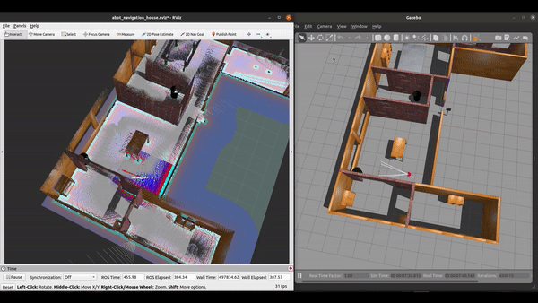

# ABot

ABot is a differential drive mobile robot based on Robot Operating System (ROS). Its tested on Ubuntu 18.04 with ROS Melodic and Ubuntu 20.04 with ROS Noetic

### Capabilities:

- [x] Manual teleop control.
- [x] SLAM with Gmapping using teleop and explore_lite.
- [x] Goal Point Navigation using dwa_local_planner and teb_local_planner.
- [x] Coverage Planning with Boustrophedon Decomposition.
- [x] Configured Behavior Tree 
- [x] Added Intel Realsense D435
- [x] RTAB-Map
- [ ] Add GPS
- [ ] Add manipulator arm

## Use ABot

To run the ABot simulation in Gazebo, clone the package in your catkin workspace, and use the launch file below.

```bash
    cd ~/catkin_ws/src
    git clone https://github.com/KamalanathanN/abot.git
    cd ~/catkin_ws
    catkin_make
    source devel/setup.bash
```

## Launch ABot in Gazebo

```bash
    roslaunch abot_gazebo robot_house_gazebo.launch
```

## ABot Simulation Model 


## ABot Gmapping using teleop

```bash
    roslaunch abot_slam abot_gmapping.launch
    roslaunch abot_teleop abot_teleop_key.launch
```


## ABot Gmapping with [explore_lite](http://wiki.ros.org/explore_lite)

```
    sudo apt install ros-noetic-explore-lite
```

```bash 
    roslaunch abot_slam abot_gmapping.launch
    roslaunch abot_navigation move_base.launch
    roslaunch explore_lite explore.launch
```


## ABot Navigation in Gazebo and Rviz
By default navigation uses ```dwa_local_planner``` with argument ```TEB:=true``` loads ```teb_local_planner```.
<details>
<summary>Read if using teb_local_planner</summary>
<br>
The default teb_local_planner pkg did not show goal reached success.
Due to this multi goal sequence was not possible.
Temporary fix is to remove the installed teb_local_planner and 
clone this modified repo : https://github.com/KamalanathanN/teb_local_planner inside the workspace.
</details>

```bash
    roslaunch abot_navigation abot_navigation.launch
```


## ABot Path Coverage implementation with Boustrophedon Decomposition

```bash
    roslaunch abot_path_coverage abot_path_coverage.launch
```


## Abot Behavior Tree Demo

Below is a simple goal points looping behaviour tree with an interrupt action to go to charge port location.

- In future, interrupt action can be used by battery monitoring node to perform auto charge behavior.
- Also planning to include camera feedback actions like object detection for other exiting behaviors :)

### Runtime Behahivor Tree monitoring with Groot

https://user-images.githubusercontent.com/31615486/152803981-b7dd6d3e-62fd-4a26-9e99-6f240f8b9eb8.mp4

Run the below commands in seperate terminals after launching ```robot_house_gazebo.launch``` and ```abot_navigation.launch``` 
```bash
    rosrun groot Groot # select Monitor option and Start

    roslaunch abot_behavior_tree goal_points_looping.launch
```
Notice the STATE of each node in tree gets highlighted with Cyan(IDLE) Yellow(RUNNING) Green(SUCCESS) Red(FAILURE)

### To provide interrput 

```bash
    rostopic pub /interrupt_event std_msgs/String "data: 'Charge_port'"
```

## ABot RTAB-Map
- Install and setup RTAB-Map from this [link](https://github.com/introlab/rtabmap/wiki/Installation)
- Clone the realsense gazebo plugin to your workspace's ```/src``` and ```catkin_make```
 
```bash
    git clone https://github.com/pal-robotics/realsense_gazebo_plugin 
 ``` 
Run the below commands in seperate terminals after launching ```robot_house_gazebo.launch```
### Mapping
```bash
    roslaunch abot_rtabmap rtab_minimal.launch args:="--delete_db_on_start"
```
- Make sure to give proper save path for ```rtabmap.db``` inside launch file.
- Make sure your world is not monotonous, have good textural variances in walls and have variety of objects.
- Use ```teleop_twist_keyboard``` or ```explore_lite``` for map creation.
- To save the map just close the terminal running the mapping node : ```ctrl+c``` 


### Navigation
First load the ```rtabmap.db``` in localization mode:
```bash
    roslaunch abot_rtabmap rtab_minimal.launch localization:=true
```
Now launch the navigation with desired local planner:
```bash
    roslaunch abot_navigation abot_navigation_rtabmap.launch TEB:=true
```



## References

[path_coverage_ros](https://gitlab.com/Humpelstilzchen/path_coverage_ros/)

[Groot with ROS](https://medium.com/teamarimac/groot-with-ros-a8f7855f8e35)

## Contributions

Your contributions are most welcomed.
